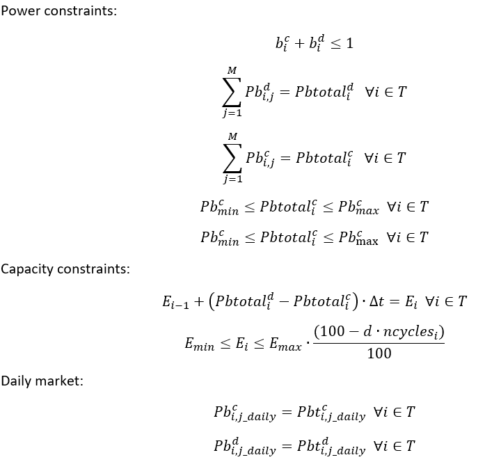
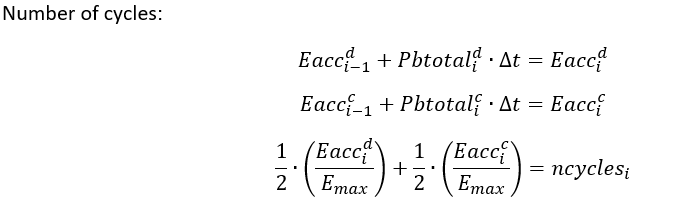
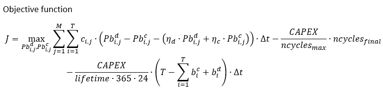
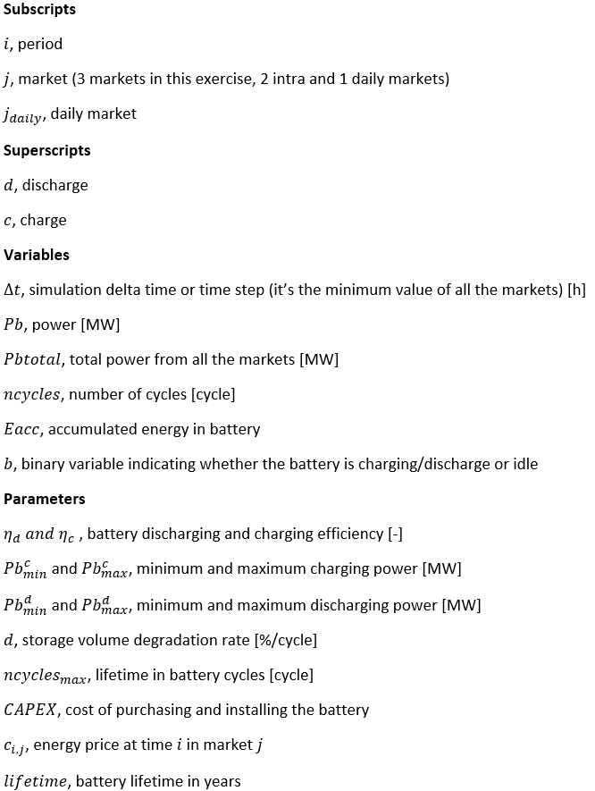
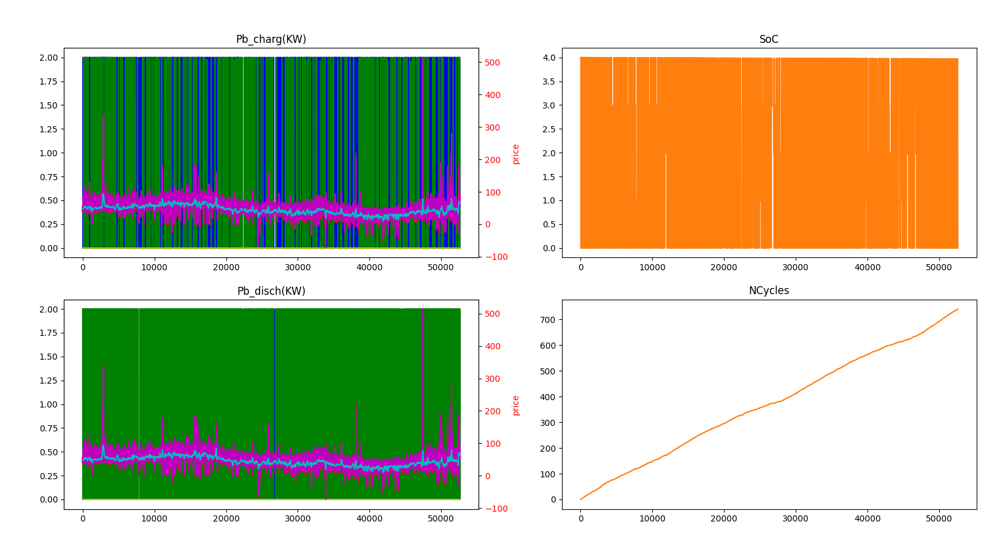
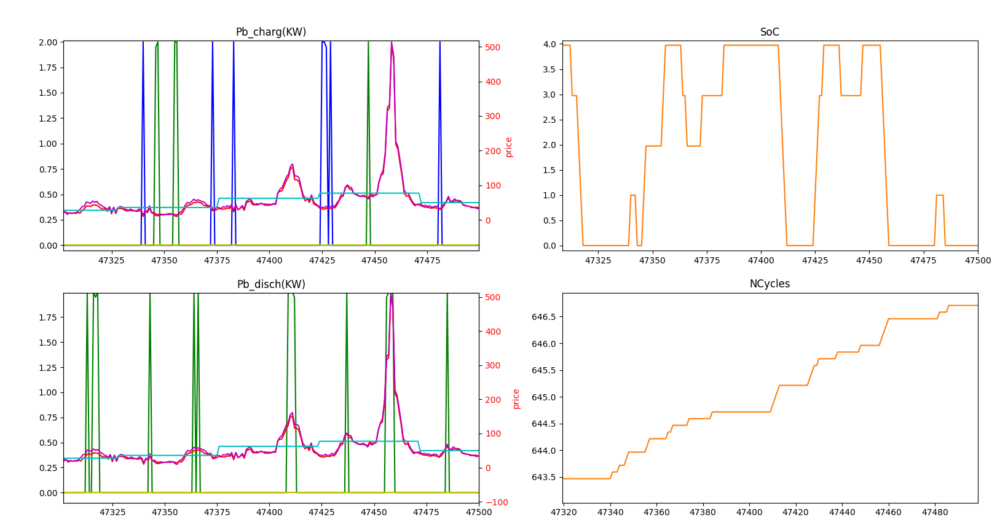

# Battery optimisation
## Aurora Research

### Project files
`Market.xlsx` data of 3 different markets 
`Battery Parameters.xlsx` battery parameters
`Battery_opt.py` contains main function you need to run to solve optimisation
`energy_classes.py` contains battery and market classes
`\pictures` folder contains screenshots of plots and equations
`Output_data.xlsx` excel file with output data from optimisation
`requirements.txt` list of package needed

### Installation requirements

## Packages and Installation

They all are latest packages.

| Package/Software        | version |
|-------------------------|---------|
| Python                  | 3.7     |
| openpyxl                | 3.0.7   |
| pandas                  | 1.2.4   |
| numpy                   | 1.20.3  |
| mip                     | 1.13.0  |
| matplotlib              | 3.4.2   |

`Python 3` support at least (e.g. `python > 3.7`)

### Installation

Requirement file added to quickly install the packages

`pip install -r requirements.txt`

### Instructions

You can run `Battery_opt.py` from your python terminal

### Coding practices

- [Formatting: PEP8](https://www.python.org/dev/peps/pep-0008/)
- [Naming: PEP8 ish](https://www.python.org/dev/peps/pep-0008/#naming-conventions)
- Version control for this project, public at the moment (happy to make it private)
- Code Formatting should be automatic before commit
- Object Oriented Programming 
- Program has been designed with unit/integration testing in mind, aiming for modularity

I took a MILP approach.
I set all market time steps to the smaller period (0.5 hours for this particual exercise).
See below constraints and objective function.
Battery tends to charge using market 1 (lower prices) and discharge in Market 2.
If not battery degradation, it tends to cycle very quickly.
I added linear battery degradation penalty which reduces the number of cycles taking advantage of higher prices and ensuring a longer life of the battery.
Calendric degradation doesn't seem to have much effect.
I’m concerned that it never goes to the daily market.
Increasing artificially the price shows that the daily market constraints work (constant power during the whole day). 
Potentially a charging/discharging ramp constraint might also force the optimization to go into the daily market.

Asumptions:

a) Fixed cost not factored in cost function
b) The full period of simulation needs to be a day expressed in hours and integers if there is a daily market (i.e. no 2.3 days)
c) Battery degradation has been linearised and it's been added as a linear penalty in the cost function, proportional to CAPEX-lifetime cycles ratio

Program is encapsulated into 2 classes.

The two classes are:
- `Battery` takes the market data and it stores battery parameters and solution from optimization.
- `Market` stores prices for those markets

## Observations

I made sure that the number of cycles calculated were reasonable. I can calculate the maximum number of cycles and then I can add up the actual number of cycles from the solution plus the idle time.
As stated above market 2 prices are generally higher so battery uses it for charging while discharging in market 1.

A bit worried that battery doesn't go into market 3. I've increased the prices of market 3 x10 and then I can see the constraints are working fine. I might be missing something here.
Perhaps the degradation penalty should force to slower charge/discharge cycles.
Calendric degradation doesn't have much effect so that's another source of error to check.

### TODO

Loads to do but I'm well over the 2-3 hours timeframe given. Just over 4 hours now.

- [ ]  fall back strategies:
	- [ ] Do post-process before plot to avoid error
	- [ ] full queue, slow down producer threads
- [ ] Error/warning logging and exception handling
- [ ] Increase abstraction of classes and modularity ie declare variables, constraints and objective function in separate methods.
- [ ] Solution is slow, there is a lot of potential to reduce the number of variables as daily market has the same number of associated variables as the intraday markets.
- [ ] Non-linear approach to battery degradation, using bilinear or [piecewise]https://www.sciencedirect.com/science/article/pii/S0306261919320471 tricks seen in the literature.

### License

Aurora Research